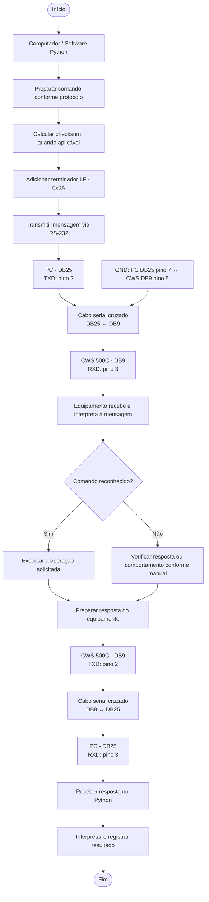

# CWS 500C — Comunicação e Automação

## Objetivo

Este documento registra o fluxo conceitual de comunicação entre um computador (software Python) e o gerador CWS 500C por meio de uma interface serial RS-232.

## Fluxo de comunicação

## Referência inicial da ligação serial

| Sinal | PC — DB25 | CWS 500C — DB9 |
|---|---:|---:|
| TXD | Pino 2 | Pino 3 (RXD) |
| RXD | Pino 3 | Pino 2 (TXD) |
| GND | Pino 7 | Pino 5 |

A ligação TXD/RXD é cruzada. Confirmar os conectores, a pinagem e a interface efetivamente disponível no computador antes de montar ou adquirir o cabo.

## Parâmetros e protocolo

- Interface física informada no manual: RS-232.
- Formato de dados mencionado nas anotações: 8 bits de dados.
- A configuração completa da serial (baud rate, paridade, bits de parada e controle de fluxo) ainda deve ser confirmada.
- O protocolo de comandos aparenta ser específico do fabricante. Não assumir compatibilidade com SCPI sem confirmação documental.
- `LF` (*Line Feed*) corresponde ao byte `0x0A`.
- A regra de checksum anotada é `100H - soma dos códigos ASCII`, mas ainda é necessário confirmar quais bytes entram na soma e se o checksum é transmitido como byte bruto ou como representação textual.

## Blocos do equipamento

| Bloco | Função anotada |
|---|---|
| Block 0 | Setup |
| Block 1 | Rotinas de teste |
| Block 2 | Calibração |

Confirmar no manual os comandos exatos para selecionar e consultar o bloco ativo.

## Status das informações

- **Confirmado no material consultado:** registrar somente informações diretamente verificadas no manual.
- **Em investigação:** detalhes ainda não confirmados, como parâmetros seriais completos e formato exato do checksum.
- **Não validado:** comportamento observado apenas em hipótese ou ainda não testado no equipamento.

## Próximas etapas

- [ ] Confirmar a pinagem no manual e no equipamento.
- [ ] Confirmar baud rate, paridade, stop bits e controle de fluxo.
- [ ] Confirmar a estrutura completa de uma mensagem.
- [ ] Confirmar os bytes incluídos no cálculo do checksum.
- [ ] Confirmar como o checksum é transmitido.
- [ ] Identificar comandos de consulta e seleção de bloco.
- [ ] Realizar primeiro teste de comunicação sem acionar saída de RF.
- [ ] Registrar comandos enviados, respostas recebidas e resultados dos testes.
